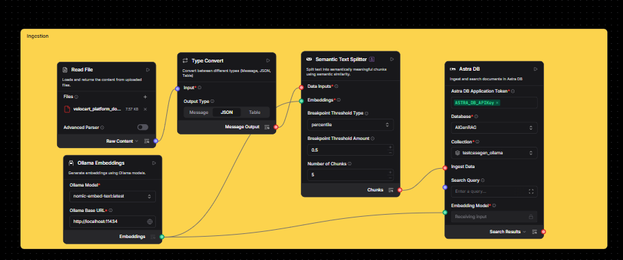
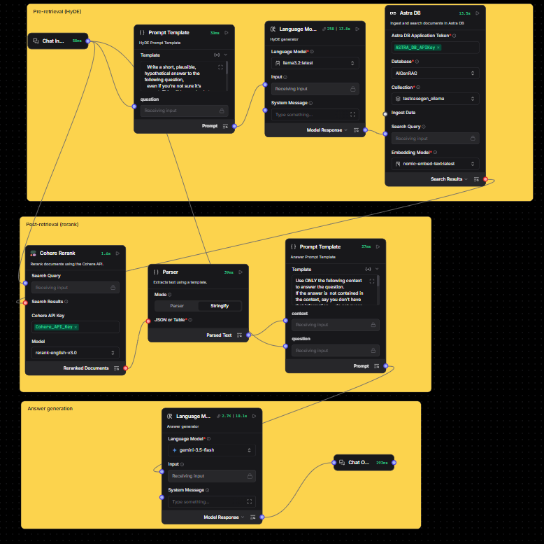

# Advance RAG

> Ask questions against your own documents and get grounded answers — with hypothetical-answer query expansion (HyDE), semantic chunking, and reranking to make retrieval more accurate than a basic RAG pipeline.

    

## What It Does

Upload a document, ask a question in plain language, and get back an answer grounded strictly in that document's content — orchestrated entirely as a Langflow flow with Ollama embeddings, Astra DB vector storage, and a Gemini/Groq language model for generation. No prompt engineering required on your end: the retrieval strategy (query expansion, over-fetch, rerank) is pre-built into the flow so answer quality doesn't depend on how you phrase the question. Output is a plain-text/Markdown answer returned via Langflow's Chat Output, viewable in the Langflow Playground or via the API.

## Architecture

```
                                    ┌─────────────────────┐
                                    │   Read File (PDF)   │
                                    └──────────┬───────────┘
                                               │ Message
                                    ┌──────────▼───────────┐
                                    │     Type Convert      │  (Message → Data)
                                    └──────────┬───────────┘
                                               │ Data
                          Ollama Embeddings ──►│
                                    ┌──────────▼───────────┐
                                    │ Semantic Text Splitter│
                                    └──────────┬───────────┘
                                               │ Chunks
                                    ┌──────────▼───────────┐
                          Ollama    │   Astra DB (ingest)   │
                       Embeddings ─►│    testcasegen_...    │
                                    └────────────────────────┘

┌─────────────┐   raw question    ┌──────────────────────┐
│  Chat Input  ├──────────────────►│ HyDE Prompt Template  │
└──────┬───────┘                  └──────────┬───────────┘
       │                                     │ hypothetical answer
       │                          ┌──────────▼───────────┐
       │                          │  Language Model (HyDE) │
       │                          └──────────┬───────────┘
       │                                     │ search query
       │                          ┌──────────▼───────────┐
       │                          │  Astra DB (retrieve)   │  k = 20 candidates
       │                          └──────────┬───────────┘
       │  original question                  │ 20 candidates
       ├────────────────────────►┌──────────▼───────────┐
       │                          │    Cohere Rerank       │  top_n = 6
       │                          └──────────┬───────────┘
       │                                     │ reranked docs (list)
       │                          ┌──────────▼───────────┐
       │                          │  Parser (Stringify)    │
       │                          └──────────┬───────────┘
       │                                     │ context text
       │  original question        ┌─────────▼───────────┐
       └───────────────────────────► Answer Prompt Template│
                                    └──────────┬───────────┘
                                               │ grounded prompt
                                    ┌──────────▼───────────┐
                                    │ Language Model (Answer)│
                                    └──────────┬───────────┘
                                               │ answer
                                    ┌──────────▼───────────┐
                                    │      Chat Output      │
                                    └────────────────────────┘
```

| Service | Port | Role |
|---|---|---|
| Langflow server | `7860` | Hosts and executes the flow; exposes the REST API |
| Ollama | `11434` | Local embedding model (`nomic-embed-text` or similar) |
| Astra DB | (hosted, HTTPS) | Vector store for both ingestion and retrieval |

**Per-hop summary:**
1. **Read File → Type Convert → Semantic Text Splitter → Astra DB (ingest)** — the document is parsed, converted from a `Message` to a `Data` object (Read File's native output type isn't accepted by the splitter), chunked on semantic boundaries, embedded via Ollama, and stored.
2. **Chat Input → HyDE Prompt → Language Model** — the raw question is used to generate a *hypothetical* answer, purely to improve what gets embedded for search.
3. **HyDE's hypothetical answer → Astra DB (retrieve, k=20)** — the hypothetical answer, not the raw question, is embedded and searched, over-fetching 20 candidates.
4. **Original question + 20 candidates → Cohere Rerank (top_n=6)** — a cross-encoder re-scores the candidates against the *real* question and keeps the best 6 (configured `top_n`, though the original design target was 4 — worth reviewing whether 6 is intentional).
5. **Reranked docs → Parser → Answer Prompt → Language Model → Chat Output** — the reranked chunks (top 6, per current config) are flattened to text and combined with the original question into a grounded prompt for the final answer.

## AI Integration

**Why Langflow as the orchestration layer:** it lets the retrieval strategy (HyDE, over-fetch, rerank) be wired visually as a graph and swapped/tuned without touching application code — the whole pipeline is inspectable and testable via its REST API.

**Why Ollama for embeddings:** local, free, no per-call cost or rate limit — important since ingestion re-embeds every chunk on every ingest run.

**Why Astra DB:** managed vector store with a REST Data API, avoiding self-hosted vector DB operations.

**Why Cohere Rerank:** embedding similarity and true relevance aren't the same thing; a dedicated cross-encoder re-scoring pass measurably improves precision on queries where multiple candidate chunks look similar at the embedding level (see Troubleshooting → Testing Findings below).

**Where the AI calls happen:** entirely inside the Langflow flow (`LangFlow_Export_JSON_File.json`) — there is no separate application backend in this project. The flow is invoked over HTTP:

```bash
curl -X POST "http://localhost:7860/api/v1/run/<FLOW_ID>?stream=false" \
  -H "Content-Type: application/json" \
  -H "x-api-key: <LANGFLOW_API_KEY>" \
  -d '{
    "output_type": "chat",
    "input_type": "chat",
    "input_value": "What are the pricing tiers and how much do they cost?"
  }'
```

**Real response** (captured from this flow, not invented):
```json
{
  "text": "Based on the provided context, the pricing tiers and their monthly costs are:\n\n*   **Starter:** $29 per month\n*   **Growth:** $99 per month\n*   **Scale:** $349 per month\n*   **Enterprise:** Custom pricing",
  "properties": {
    "source": { "id": "LanguageModelComponent-PnKMG", "display_name": "Language Model", "source": "gemini-3.5-flash" },
    "usage": { "input_tokens": 2111, "output_tokens": 558, "total_tokens": 2669 }
  }
}
```

**Session ID:** not explicitly set per-request in the examples above — Langflow auto-generates one if omitted. Pass an explicit `session_id` in the request body if you need conversation memory isolated per user/test run.

**Response parsing:** the answer text lives at `outputs[0].outputs[0].results.message.text`; token usage and which model actually answered are under `...message.data.properties`.

**Where the prompts live:** inside the two **Prompt Template** nodes in the flow (`Prompt Template-s0NvS` for HyDE, `Prompt Template-kdaYU` for the final answer) — not in any external file.

**Swapping the LLM:** change the **Model** dropdown on either **Language Model** node (`LanguageModelComponent-p597W` for HyDE, `LanguageModelComponent-PnKMG` for the answer) — supports Ollama, Gemini, Groq, OpenAI, and others without touching any wiring.

## Prerequisites

| Requirement | Version | Notes |
|---|---|---|
| Langflow | 1.10.x | `pip install langflow`, run with `langflow run` |
| Python | 3.12+ | Required by Langflow itself |
| Ollama | latest | Running locally with an embedding model pulled (e.g. `ollama pull nomic-embed-text`) |
| Astra DB account | — | Free tier at [astra.datastax.com](https://astra.datastax.com) |
| Cohere account | — | Free trial key at [dashboard.cohere.com](https://dashboard.cohere.com) |
| Gemini or Groq API key | — | For the two Language Model nodes |

## Installation

```bash
pip install langflow
langflow run
```

Then open `http://localhost:7860` in a browser.

## Configuration

This project has no application-level `.env` — all credentials are stored as Langflow global variables/credentials inside the Langflow UI (Settings → Global Variables), referenced by name from each node's API key field. When importing the flow, you will need to create these variables yourself:

| Variable name | What it is | How to get it |
|---|---|---|
| `ASTRA_DB_APIKey` | Astra DB Application Token | Astra console → your database → Settings → Application Tokens |
| `GOOGLE_API_KEY` | Gemini API key | [aistudio.google.com/apikey](https://aistudio.google.com/apikey) |
| `Cohere_API_Key` | Cohere API key | [dashboard.cohere.com](https://dashboard.cohere.com) → API Keys |

## AI Service Setup

1. **Import the flow**: Langflow dashboard → **My Flows** → **Import** → select `LangFlow_Export_JSON_File.json`.
2. **Get the Flow ID**: after importing, the URL becomes `http://localhost:7860/flow/<FLOW_ID>/...` — copy the UUID.
3. **Add Astra DB credentials**: open both **Astra DB** nodes (ingest and retrieve) → Database → select or connect your Astra database → set the Collection Name.
4. **Add the Cohere key**: open the **Cohere Rerank** node → API Key field → link to `Cohere_API_Key` or paste directly.
5. **Add the Gemini/Groq key**: open both **Language Model** nodes → API Key field → link to `GOOGLE_API_KEY` (or your chosen provider's variable).
6. **Confirm Ollama is running**: `curl http://localhost:11434/api/tags` should list your embedding model.

## Running Locally

```bash
langflow run
```
Starts the Langflow server on `http://localhost:7860`. Open the flow, click **Play**, then use the **Playground** to chat with it.

## Using the App

1. Open the flow in Langflow and click the **Files** field on the **Read File** node to upload your document.
2. Click **Play** to run ingestion (chunks the document and stores it in Astra DB).
3. Open the **Playground**, type a question, and press **Ask**.
4. Review the answer — expand the build results on the **Cohere Rerank** and **Astra DB** nodes to inspect exactly which chunks were retrieved and reranked for that answer.


*The actual ingestion side of the built flow: Read File (`velocart_platform_docs.pdf`, 7.57 KB) → Type Convert (Message → JSON) → Semantic Text Splitter (`percentile` threshold, amount `0.5`, target `5` chunks) → Ollama Embeddings (`nomic-embed-text:latest`) → Astra DB (database `AIGenRAG`, collection `testcasegen_ollama`).*


*The actual retrieval + generation side, grouped by stage exactly as designed: **Pre-retrieval (HyDE)** — Chat Input → HyDE Prompt → Language Model (`llama3.2:latest`) → Astra DB search (k=20); **Post-retrieval (rerank)** — Cohere Rerank (`rerank-english-v3.0`, ~1.6s) → Parser (Stringify mode) → Answer Prompt; **Answer generation** — Language Model (`gemini-3.5-flash`, ~10.1s) → Chat Output. Per-node timings visible here are useful reference points for the T03 latency test.*

## Input Format

Any document Langflow's **Read File** component supports (PDF, TXT, MD, CSV, DOCX). The included sample, `sample_docs/velocart_platform_docs.pdf`, is a 6-section synthetic product/API documentation file deliberately built with:
- Multiple topically-adjacent-but-distinct sections (for precision testing)
- A code block and a pricing table (for chunking-integrity testing)
- An embedded Spanish-language paragraph (for mixed-language chunking testing)

**Recommended input structure:** documents with clearly labeled sections/headings retrieve more reliably than unstructured prose, since both semantic chunking and reranking rely on distinguishable topic boundaries.

## Output Format

```json
{
  "text": "<the answer, Markdown-formatted>",
  "properties": {
    "source": { "source": "<model name that generated the answer>" },
    "usage": { "input_tokens": 0, "output_tokens": 0, "total_tokens": 0 }
  }
}
```

| Field | Meaning |
|---|---|
| `text` | The final grounded answer |
| `properties.source.source` | Which LLM actually generated it (useful when multiple providers are configured across environments) |
| `properties.usage` | Token accounting for the generation call |

## Sample Files

**Input document:**

| File | Format | Covers |
|---|---|---|
| `sample_docs/velocart_platform_docs.pdf` | PDF | Auth, User Management, Payments, Search, Notifications, Reporting |

**Screenshots:**

| File | Shows |
|---|---|
| `Flow_ScreenShot/Injestion_LangFlow_Diagram.png` | The actual built ingestion pipeline: Read File → Type Convert → Semantic Text Splitter → Astra DB, with real node configuration values visible |
| `Flow_ScreenShot/Retrieval_Rerank_Generation_LangFlow_Diagram.png` | The actual built retrieval + generation pipeline, grouped by stage: Pre-retrieval (HyDE), Post-retrieval (rerank), Answer generation — with real model names and per-node timings visible |

## API Reference

```bash
curl -X POST "http://localhost:7860/api/v1/run/<FLOW_ID>?stream=false" \
  -H "Content-Type: application/json" \
  -H "x-api-key: <LANGFLOW_API_KEY>" \
  -d '{"output_type":"chat","input_type":"chat","input_value":"What are the login test cases?"}'
```

Success response shape:
```json
{
  "session_id": "...",
  "outputs": [{
    "outputs": [{
      "results": { "message": { "text": "...", "properties": { "source": {}, "usage": {} } } }
    }]
  }]
}
```

## Project Structure

```
Advanced_RAG/
├── README.md                          # this file
├── advanced_rag_langflow_guide.md     # full manual build guide, gotchas, and QA test log
├── LangFlow_Export_JSON_File.json     # exported Langflow flow definition (secrets stripped)
├── sample_docs/
│   └── velocart_platform_docs.pdf     # test document used for all QA scenarios
└── Flow_ScreenShot/
    ├── Injestion_LangFlow_Diagram.png                    # actual built ingestion pipeline
    └── Retrieval_Rerank_Generation_LangFlow_Diagram.png  # actual built retrieval/rerank/answer pipeline
```

## Team Adoption Checklist

- [ ] Install Langflow (`pip install langflow`) and confirm `langflow run` starts on port 7860
- [ ] Install Ollama and pull an embedding model (`ollama pull nomic-embed-text`)
- [ ] Create an Astra DB database and copy the Application Token
- [ ] Create a Cohere trial API key
- [ ] Create a Gemini (or Groq) API key
- [ ] Import `LangFlow_Export_JSON_File.json` into Langflow
- [ ] Set up the three global variables/credentials listed in Configuration
- [ ] Open both Astra DB nodes and select/create your collection
- [ ] Upload `sample_docs/velocart_platform_docs.pdf` via the Read File node and run ingestion
- [ ] Ask a baseline question in the Playground (e.g. "What happens if my payment fails?") and confirm a grounded answer comes back
- [ ] Run the T01–T05 QA scenarios from `advanced_rag_langflow_guide.md` and compare against the documented expected findings

## Troubleshooting

**`Error building Component Type Convert: list index out of range`**
Cause: the node upstream (an Astra DB search) returned zero results, usually because `search_query` was never wired in.
Fix: 1) Open the retrieval Astra DB node. 2) Confirm `Search Query` has an incoming connection (from Chat Input or the HyDE Language Model). 3) Retry.

**`Error building Component Parser: List of Data objects is not supported`**
Cause: Parser's default "Parser" mode only accepts a single Data/DataFrame object, but Cohere Rerank's output is a list of results.
Fix: Open the Parser node → set **Mode** to **Stringify**.

**`ChatGoogleGenerativeAIError: ... API key required for Gemini Developer API`**
Cause: the API key field has `load_from_db: true`, meaning Langflow is treating the typed value as the *name* of a saved credential rather than the literal key.
Fix: Toggle the field (usually a small link/globe icon next to it) from "select saved variable" to "type a value directly," then paste the real key.

**`LocalProtocolError: Illegal header value b'Bearer '`**
Cause: an API key field is empty, and the component still tries to build an `Authorization: Bearer <key>` header — even for local providers (e.g. Ollama) that don't need one.
Fix: For local providers, type any non-empty placeholder string into the key field. For hosted providers, add the real key.

**Astra DB returns 0 search results / wrong-looking answers despite successful ingestion**
Cause: embedding-dimension or embedding-provider mismatch between what was used to *ingest* the collection and what's used to *query* it (e.g. switched from OpenAI to Gemini/Ollama embeddings without resetting the collection).
Fix: Use a fresh Astra collection name whenever the embedding provider or model changes, and re-ingest.

**Same chunk appears duplicated many times in retrieval results**
Cause: the ingestion-side Astra DB node is still wired into the live query path, so every chat message silently re-triggers ingestion — and Astra's duplicate-detection can fail to catch re-ingested identical text (each `Data` object gets a fresh timestamp, defeating equality-based dedup).
Fix: Ensure the ingest Astra DB node is only reachable via a manual "ingest" trigger, not via any path that also leads to Chat Output.

### Testing Findings

Full QA test scenarios (T01–T05), the exact queries used, real results, and the general RAG Testing Taxonomy are documented in **[`advanced_rag_langflow_guide.md` → QA Test Scenarios](advanced_rag_langflow_guide.md#qa-test-scenarios--advanced-rag)** — kept there as the single source of truth rather than duplicated here, since a summary copy in two places is exactly what caused the `top_n=4` vs `6` documentation drift found in this project.

## Related Modules

| Module | Description |
|---|---|
| `Naive_RAG` | The baseline single-pass RAG pipeline (no HyDE, no reranking, fixed-size chunking) this project improves on — see its guide for the Gotchas this build inherited and fixed. |
